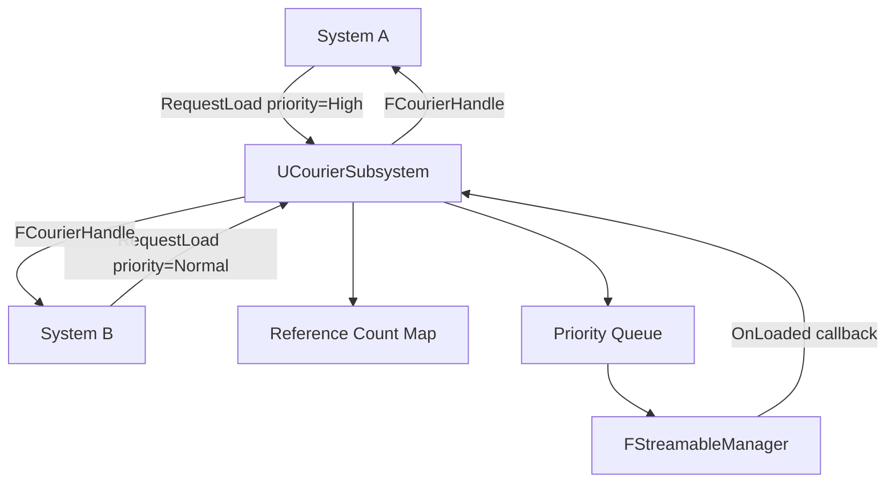
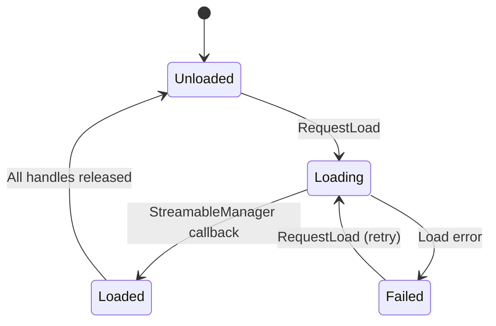

# Courier — Overview

## Problem Solved

Unreal's `FStreamableManager` provides raw async loading but offers no reference counting or priority arbitration. Multiple systems requesting the same asset can produce duplicate loads or premature unloads. Courier wraps `FStreamableManager` with:

- **Reference counting** — assets stay loaded while any handle is alive.
- **Priority queuing** — high-priority requests preempt low-priority ones in the streaming queue.
- **Load-state tracking** — query whether an asset is `Unloaded`, `Loading`, `Loaded`, or `Failed`.
- **Automatic unload** — when the last handle to an asset is released, Courier schedules the unload.

## Architecture

## Handle Lifetime

`FCourierHandle` is a lightweight RAII wrapper. While it is alive the asset it references is kept loaded. When the handle goes out of scope or is explicitly released the reference count decrements. At zero the unload is scheduled on the next Courier tick.

## Load State Machine

## Priority Levels

| Priority | Value | Typical Use |
|---|---|---|
| `Critical` | 4 | Player-critical assets (weapon in hand, active level). |
| `High` | 3 | Nearby content about to become visible. |
| `Normal` | 2 | Background preload for adjacent areas. |
| `Low` | 1 | Speculative loads, distant content. |
