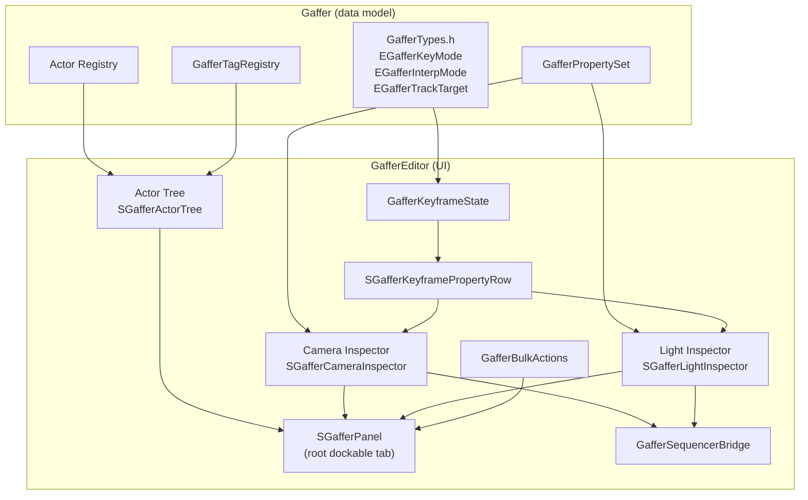

# Gaffer — Overview

## What It Is

Gaffer is a dockable Unreal Editor panel written in C++ and Slate. It replaces two Blueprint editor utility widgets — the original CameraController and LightController — with a single unified tool that handles cameras, lights, environment actors, and any actor class you register. The panel integrates directly with Sequencer to support per-property keyframing with configurable key modes, interpolation types, and track-targeting strategies. Because Gaffer is declared as an editor-only module, it compiles only for editor targets and leaves no trace in packaged builds.

The motivation for the rewrite was maintainability and capability. The Blueprint widgets had grown to hundreds of nodes each and were difficult to extend. The C++ implementation makes the same logic legible, testable, and extensible by other plugins.

## Module Layout

| Module | Type | Description |
|--------|------|-------------|
| `Gaffer` | Editor | Actor registry, core types (`GafferTypes.h`), property set, tag registry. Houses all data model classes. |
| `GafferEditor` | Editor | All Slate UI, sequencer bridge, bulk actions. Depends on `Gaffer`. |

Both modules are editor-only. The `Gaffer` module provides the data model and does not depend on Slate; `GafferEditor` owns every widget and the `GafferSequencerBridge`.

## Architecture



The root widget `SGafferPanel` owns the actor tree on the left and swaps in the appropriate inspector on the right depending on what is selected. `GafferKeyframeState` is a shared object passed down through the inspector hierarchy so that key mode, interpolation mode, track target, and the auto-key flag are consistent across every property row.

## Inspector System

### SGafferKeyframePropertyRow

Every keyframeable property in both the camera and light inspectors is rendered by `SGafferKeyframePropertyRow`. The row contains three visual zones:

1. A left circle indicator that reflects the current keyframe state of the property (no key, key at current frame, or modified since last key).
2. A label and value widget (spin box, color picker, or check box depending on type).
3. A right diamond button that triggers `GafferSequencerBridge::KeyProperty` for that specific property.

All rows in an inspector share the same `GafferKeyframeState` reference, so changing the key mode in the settings bar immediately affects every subsequent key operation in that inspector session.

### Camera Inspector

The camera inspector exposes eight keyframeable properties arranged in a primary section and a collapsible Advanced section:

**Primary section:**

| Property | Description |
|----------|-------------|
| Focal Length | CineCameraComponent focal length in millimetres |
| Aperture | F-stop value (depth-of-field) |
| ISO | Sensor ISO (exposure) |
| Shutter Speed | Shutter speed as a fraction (1/N) |
| Exposure Compensation | EV bias applied on top of auto exposure |
| Focus Distance | Manual focus distance in centimetres |
| Sensor Width | Filmback sensor width in millimetres |
| Sensor Height | Filmback sensor height in millimetres |

**Advanced section (collapsible):**

| Property | Description |
|----------|-------------|
| Blade Count | Number of diaphragm blades (bokeh shape) |

The status row at the top of the camera inspector displays the actor's class icon at 24×24 pixels, the actor label, and — when the actor is bound in an active Sequence — a green "Bound" pill.

### Light Inspector

The light inspector adapts its UI to the light type of the selected actor. All light types share a base section:

| Property | Description |
|----------|-------------|
| Intensity | Light brightness in candelas or lux |
| Attenuation Radius | Maximum reach of the light |
| Color | RGB color with interactive HSV picker |
| Use Temperature | Toggle to switch from color to temperature |
| Temperature | Color temperature in Kelvin (visible when Use Temperature is on) |

A conditional Shape section renders additional controls based on light type:

| Light Type | Additional Properties |
|------------|-----------------------|
| Spot | Inner Cone Angle, Outer Cone Angle |
| Point | Source Radius |
| Rect | Source Width, Source Height |
| Directional | Light Source Angle |

A collapsible Advanced section provides:

| Property | Description |
|----------|-------------|
| Indirect Intensity | Multiplier for indirect lighting contribution |
| Volumetric Scattering | Contribution to volumetric fog |
| Casts Shadows | Shadow casting toggle |

## Keyframing Pipeline

Keyframing in Gaffer follows a single path: a diamond button press (or an auto-key trigger) calls `SGafferInspector::AutoKeyProperty` or the row's key delegate, which invokes `GafferSequencerBridge::KeyProperty`. That function receives:

- The target actor
- A property name string matching the Sequencer track's property path
- The current `EGafferKeyMode`
- The current `EGafferInterpMode`
- The current `EGafferTrackTarget`

`KeyProperty` locates the correct movie scene track, creates or updates a key at the resolved frame, and sets its tangent type to match the requested interpolation mode.

### Key Modes

| Mode | Behaviour |
|------|-----------|
| `CurrentFrame` | Keys the property at the Sequencer playhead position |
| `FirstFrameOnly` | Keys the property at frame 0 of the active sequence, regardless of playhead |
| `MatchingValue` | Searches existing keys and updates any key whose value matches the current property value |
| `AllSelected` | Keys all actors currently selected in the Gaffer tree at the playhead position |

### Interpolation Modes

| Mode | Tangent Type |
|------|--------------|
| `Cubic` | Smooth spline tangents (auto-tangent) |
| `Linear` | Straight-line segments between keys |
| `Constant` | Step / hold — value snaps at each key |

### Track Targeting

| Target | Behaviour |
|--------|-----------|
| `First` | Writes to the first matching track on the actor |
| `Last` | Writes to the last matching track on the actor |
| `Selected` | Writes only to the track currently selected in Sequencer |

### Auto-Key

When auto-key is enabled via the settings bar toggle, every `OnValueChanged` callback in every property row calls `SGafferInspector::AutoKeyProperty`. This checks the `bAutoKeyEnabled` flag on the shared `GafferKeyframeState` and, if true, calls `GafferSequencerBridge::KeyProperty` immediately without a button press. Auto-key respects all other key mode, interpolation, and track-targeting settings.

## Groups and Tags

### Groups

A group is a named set of actors with an associated color swatch and three numeric overrides:

| Override | Description |
|----------|-------------|
| Intensity Scale | Multiplies the light intensity of all lights in the group |
| Temperature Offset | Adds a Kelvin offset to the color temperature of all lights |
| Color Tint | Multiplies the light color of all lights in the group |

Groups are edited inline in the actor tree when the group row is selected. A context menu on any actor row provides "Add to Group" and "Remove from Group" submenus listing all existing groups. Groups are stored in the `GafferGroupRegistry` and are not saved to the Sequencer sequence — they are authoring-time organizational metadata.

### Tags

Tags are free-form text labels attached to individual actors. The tag input dialog is a floating `SWindow` containing a single text field. Tags are stored in `GafferTagRegistry` keyed by actor GUID so they survive actor renames. The actor tree can be filtered to show only actors that carry a specific tag.

## Custom Class Registration

By default Gaffer's actor tree shows `ACineCameraActor`, all `ALight` subclasses, and sky/atmosphere actors. Any additional `AActor` subclass can be registered so it appears in the tree and can have properties added to its inspector.

Registration happens in a module startup function or a plugin's `StartupModule`:

```cpp
#include "GafferActorRegistry.h"

// Inside IModuleInterface::StartupModule or similar:
FGafferActorRegistry::Get().RegisterClass(
    AMyCustomLightRig::StaticClass(),
    FText::FromString(TEXT("Custom Light Rigs")),   // display category in the tree
    FSlateIcon(FMyStyle::GetStyleSetName(), "Icons.LightRig")
);
```

To also expose custom properties for keyframing, create a `UGafferPropertySet` subclass and register it alongside the class:

```cpp
FGafferActorRegistry::Get().RegisterPropertySet(
    AMyCustomLightRig::StaticClass(),
    UMyCustomLightRigPropertySet::StaticClass()
);
```

!!! note
    Registered classes and property sets are in-memory only. Re-register them each time the editor starts by placing the call in `StartupModule`.
