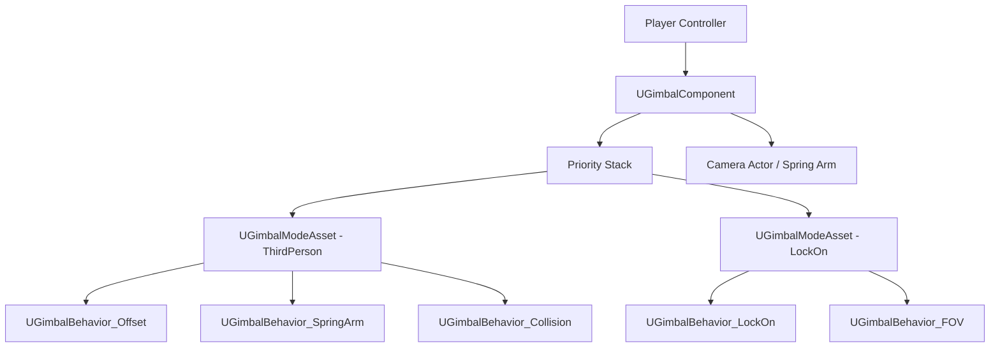

# Gimbal — Overview

## Architecture

Gimbal is built around three layered concepts: **Behaviors**, **Modes**, and the **Priority Stack**. A `UGimbalComponent` attached to your Player Controller owns the stack. Each camera mode is described by a `UGimbalModeAsset` (a Data Asset) and activates one or more `UGimbalBehavior` objects that drive offset, lag, collision, and FOV per-frame.

## Priority Stack Blending

Every active mode has an integer priority. When multiple modes are active simultaneously (e.g., a combat lock-on layered over the default third-person view), Gimbal blends their outputs using configurable blend curves and weights. Higher priority modes take precedence but can opt into additive composition instead of override.

## Camera Modes

| Mode | Description |
|---|---|
| Third-Person | Spring-arm offset with lag, collision avoidance, and pitch/yaw limits |
| First-Person | Head-socket attachment with optional weapon FOV separation |
| Top-Down | Fixed world-space height with optional follow deadzone |
| Side-Scroller | Fixed world-space Y with horizontal follow and parallax hint |
| Fixed | Static world transform, useful for cutscenes and security cameras |
| Orbit | Spherical orbit around a target with zoom and elevation limits |

## Lock-On Targeting

The lock-on subsystem maintains a sorted candidate list based on distance, screen centrality, and a team relationship query. `UGimbalBehavior_LockOn` interpolates the camera pivot toward the locked target each frame, and exposes a cycling API (next/previous target) that re-sorts the candidate list on demand.

## Key Design Decisions

- **Data-first** — every parameter lives in a `UGimbalModeAsset` or `UGimbalPresetAsset`. Designers iterate without recompiling.
- **Zero forced base classes** — attach `UGimbalComponent` to any `AController` subclass.
- **Spring-arm independent** — Gimbal can drive a Spring Arm component or bypass it entirely and write directly to a `UCameraComponent` transform.
- **Behavior composition** — behaviors are small, single-responsibility objects. Stack as many as needed per mode.
