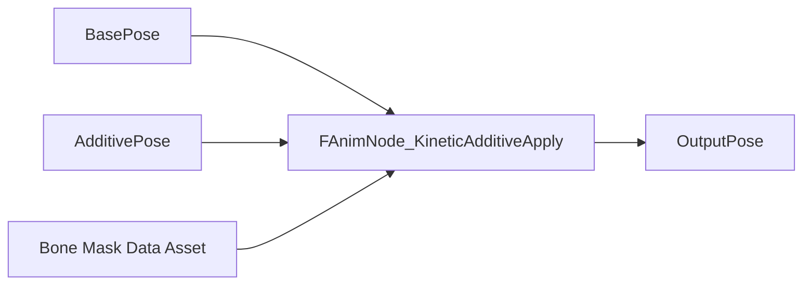

# Kinetic — Overview

## Philosophy

Unreal's Animation Blueprint is powerful but verbose. Kinetic condenses common animation patterns — layered additive blending, procedural secondary motion, bone-mask management — into a curated set of nodes that snap directly into your Anim Graph.

## Node Categories

### Layered Additive Apply

`FAnimNode_KineticAdditiveApply` is the workhorse node. It layers an additive pose onto a base pose using a bone mask, with per-bone alpha curves and blend space support.

### Procedural Body Dynamics

The `FAnimNode_KineticBodyDynamics` node applies spring-physics secondary motion to a bone chain (e.g., hair, cloak, tail). Parameters are exposed per-bone: stiffness, damping, gravity scale, and max angle clamp. All simulation runs inside the animation worker thread — no game-thread overhead.

### State Simplification

`FAnimNode_KineticStateProxy` wraps multiple Blend Spaces behind a single normalized input, reducing a common 5-node pattern to one node. Feed it a cardinal direction vector and it selects and blends the correct 8-directional locomotion assets automatically.

### Bone Mask Assets

`UKineticBoneMaskAsset` stores a named list of bone names and per-bone blend weights. Create one per character archetype (humanoid, quadruped, tentacle) and reference it in any Kinetic node. Changing the mask updates every node referencing it simultaneously.

## Integration Points

- Works alongside all standard UE animation nodes — no forced base classes for `UAnimInstance`.
- Compatible with Control Rig.
- Thread-safe: all nodes implement `NeedsOnInitializeAnimInstance` and `Update_AnyThread` correctly.
- Supports Linked Anim Layers — Kinetic nodes can live in any layer graph.
