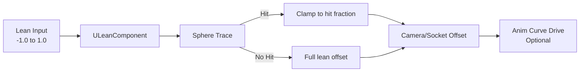

# Lean — Overview

## How It Works

`ULeanComponent` drives leaning by offsetting the character's camera (or a designated scene component) along a configurable lean axis each frame. Before applying the offset it runs a sphere trace at the target lean position. If the trace hits geometry the lean is clamped to the collision point, preventing the camera from clipping through walls.

## 360-Degree Support

Lean is not limited to left/right. The component accepts any normalized 2D direction vector, allowing diagonal leans, forward leans (tactical blade stances), and backward leans. This is especially useful for top-down and isometric games where "leaning" is directional relative to the aim direction.

## Collision Model

The collision check uses a configurable capsule or sphere trace. Three parameters govern the behavior:

- **LeanTraceRadius** — radius of the sphere trace at the lean target position.
- **LeanTraceLength** — maximum lean distance before the trace runs.
- **LeanTraceChannel** — which `ECollisionChannel` the trace runs against.

If the trace hits, the usable lean fraction is `HitResult.Time`, and the lean offset is `DesiredOffset * HitResult.Time`.

## Replication

The lean value is replicated as a compressed `int8` (mapped from -1.0 to 1.0). The replicated value drives the visual animation curve on proxies; actual collision is only computed on the owning client and the server.

## Animation Integration

Lean exposes a normalized `LeanValue` float that you can drive directly into your Anim Blueprint. Connect it to a **Lean Left/Right** blend space or use it to set a morph target on the character mesh.
