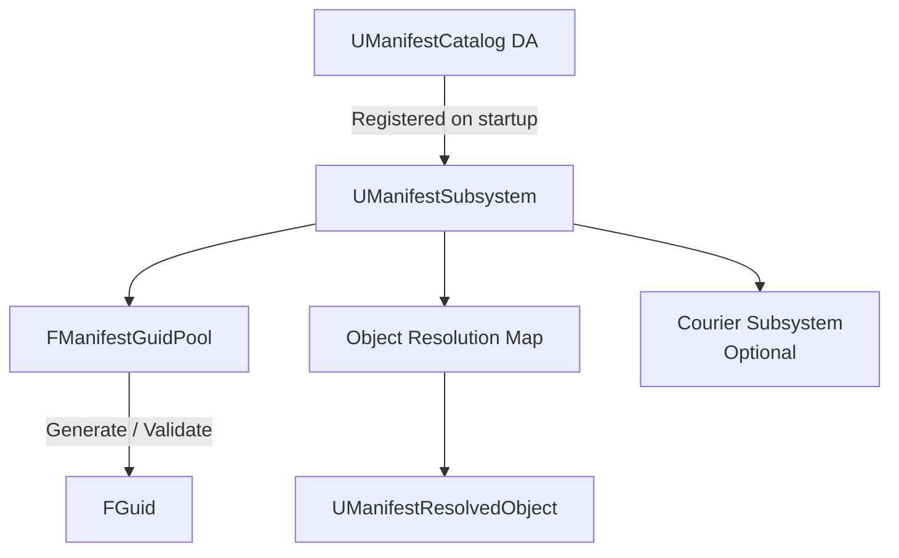
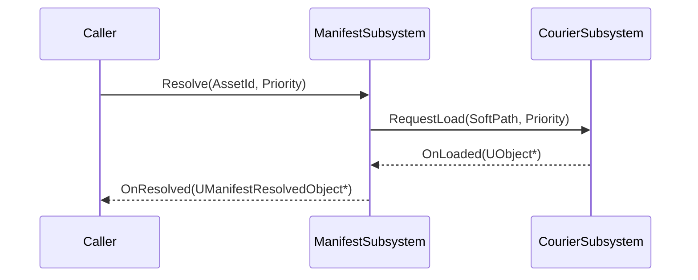

# Manifest — Overview

## Why Manifest?

Large games need a runtime index of all things: item definitions, character archetypes, ability templates. `UAssetManager` handles disk-level discovery but doesn't provide runtime GUID pools, per-object resolution callbacks, or integration with streaming systems. Manifest fills that gap.

## Architecture

## Catalog Registration

`UManifestCatalog` is a Data Asset that holds an array of `FPrimaryAssetId` entries plus metadata (tags, display name, category). At game startup `UManifestSubsystem` loads all catalogs configured in Project Settings and indexes every entry into its resolution map.

## GUID Pools

`FManifestGuidPool` provides deterministic GUID generation scoped to a namespace string. GUIDs generated from the same namespace and seed always produce the same result, making save data consistent across game sessions.

## Runtime Resolution

`UManifestResolvedObject` is the runtime shell wrapping a resolved definition. It holds the `FPrimaryAssetId`, a weak pointer to the loaded `UObject`, and a load state. Requesting resolution of an asset that isn't loaded yet optionally triggers Courier to load it.

## Courier Integration

When `bUseCourierForLoading` is enabled in Project Settings, calling `UManifestSubsystem::Resolve` with `ECourierPriority` automatically routes the load through `UCourierSubsystem`, giving you reference counting and priority queuing for free.

