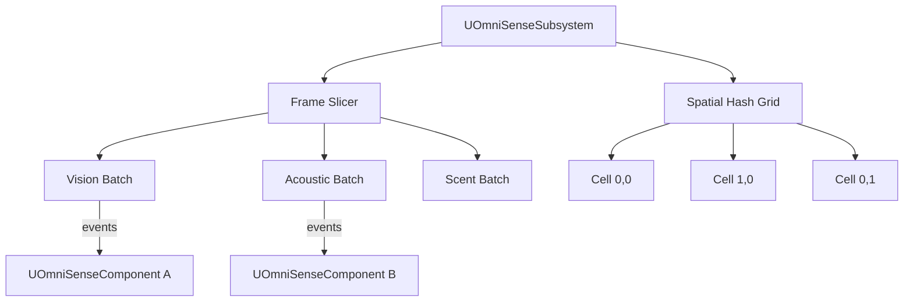

# OmniSense — Overview

## Why Not AIPerception?

Unreal's built-in AIPerception runs all sense updates synchronously every tick. At scale this becomes expensive because trace budgets and update intervals are per-agent rather than globally managed. OmniSense centralizes all sense queries through a `UOmniSenseSubsystem` that owns a spatial hash grid and distributes work across frames using a configurable time-slice budget.

## Architecture

## Senses

### Vision
Frustum-based line-of-sight check. Each agent specifies a half-angle, range, and occlusion filter. The frame slicer batches all vision checks for the current slice and fires `OnStimulusDetected` events only when state changes (new detection or loss of sight).

### Acoustic Pings
Periodic sphere-cast pings with optional propagation delay simulation. An agent emitting a sound registers a ping with a radius and lifetime. Nearby agents with acoustic sensitivity receive `OnAcousticStimulus` events.

### Scent Trails
Scent emitters deposit world-space tokens at configurable intervals. Tokens decay over time. Agents with scent sensitivity query the subsystem for tokens within their detection radius and receive `OnScentStimulus` events with the token age and origin actor.

### Team Relationship Matrix
OmniSense maintains a `UOmniSenseTeamMatrix` Data Asset mapping team pairs to relationship values (Hostile, Neutral, Friendly). All sense events carry the relationship context so agents can filter detections without additional queries.

## Performance Model

| Technique | Benefit |
|---|---|
| Spatial hash grid | Only checks agents in adjacent cells — O(1) neighbor lookup. |
| Frame slicing | Distributes N agents across K frames, limiting per-frame cost. |
| Event-only callbacks | No per-frame polling; agents receive callbacks only on state change. |
| Occlusion caching | Vision occlusion results cached for `OcclusionCacheLifetime` seconds. |
