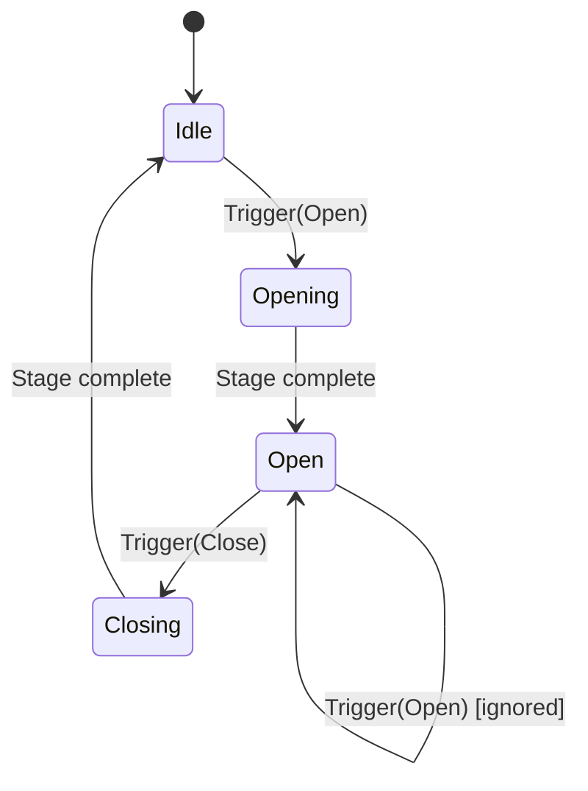
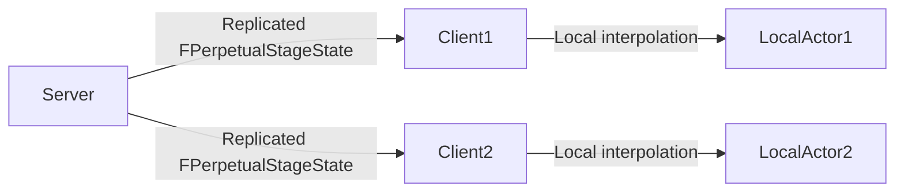

# Perpetual — Overview

## Core Concept

A `UPerpetualAnimationComponent` drives an actor through a sequence of named **stages**. Each stage defines a target relative transform (location, rotation, scale), an easing curve, a duration, and optional audio/particle events to fire at the start or end of the stage. Stages are stored in a `UPerpetualAnimationAsset` Data Asset.

## Stage Machine

Perpetual is not a general state machine — it is a **linear stage sequencer** with optional reverse and loop support. Each stage can:

- Specify a **next stage** to chain automatically (e.g., door opens then auto-closes after 3 seconds).
- Specify a **reverse stage** allowing the component to rewind to a previous state.
- Loop indefinitely (for fans, spinning platforms, oscillating lights).

## Multi-Component Support

One `UPerpetualAnimationAsset` can drive multiple `USceneComponent` targets within the same actor simultaneously. This is useful for compound objects like a chest with a lid and a lock latch that open in sync.

## Replication

`UPerpetualAnimationComponent` replicates stage transitions via a replicated `FPerpetualStageState` struct. Clients receive the current stage and elapsed time, then interpolate locally — no RPC spam per frame.

## Event Delegates

| Delegate | When fired |
|---|---|
| `OnStageBegin` | At the start of each stage transition. |
| `OnStageComplete` | When a stage reaches its target transform. |
| `OnSequenceComplete` | When the last non-looping stage finishes. |
