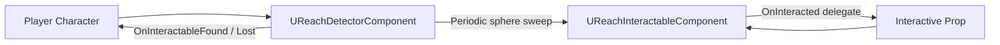

# Reach — Overview

## Two-Component Model

`UReachDetectorComponent` sits on the player (or AI). Every `DetectionInterval` seconds it runs a sphere sweep and updates its list of in-range interactables. It fires `OnInteractableFound` and `OnInteractableLost` delegates for HUD integration.

`UReachInteractableComponent` sits on each prop. It receives the interaction event, validates any conditions, and fires `OnInteracted`. No subclassing required.

## Interaction Modes

| Mode | Description |
|---|---|
| `Instant` | Single press triggers interaction immediately. |
| `Hold` | Player must hold the interact button for `HoldDuration` seconds. Progress reported via `OnHoldProgress`. |
| `Smash` | Player must press the button `SmashCount` times within `SmashWindow` seconds. |
| `Rhythm` | Player must press at timed intervals defined by a `UCurveFloat` rhythm pattern. |

## Condition Checks

`UReachInteractableComponent` supports an optional condition predicate. Implement `CanInteract` in a subclass or Blueprint to return false and block the interaction (e.g., "door is locked", "item already picked up").

## Replication

On a server-authority setup, the interact event is sent as an RPC to the server. The server validates the distance and condition, then fires `OnInteracted` on the owning actor. Clients receive an acknowledgement multicast.

## Priority

When multiple interactables are in range, the detector sorts them by a configurable priority field on `UReachInteractableComponent`. The highest-priority interactable is selected as the "focused" target.
