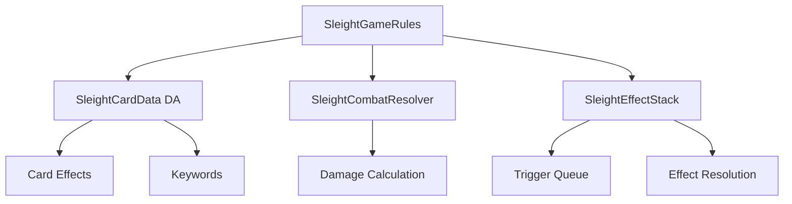

# Sleight — Overview

## Core Abstractions

### SleightGameRules

The rule engine. Defines legal plays, turn structure, win/loss conditions, and zone rules (deck, hand, battlefield, graveyard, exile). Rules are subclassed per game type — e.g., `USleightRules_Deckbuilder` for roguelike-style games, `USleightRules_TCG` for competitive trading card games.

### SleightCardData

A Data Asset describing a single card. Contains:
- **Cost** (mana, energy, or any resource defined by the game rules)
- **Keywords** (array of `FGameplayTag`-based keywords: Haste, Trample, Flying, etc.)
- **Effects** (array of `FSleightEffect` structs defining what happens when played)
- **Combat stats** (Attack, Defense — optional, only relevant in combat-enabled modes)
- **Artwork** (soft reference to texture for optional visual integration)

### SleightEffectStack

Effects are not applied immediately when a card is played. They are pushed onto the `SleightEffectStack` and resolved in order, allowing other effects and triggers to interject. This models the **stack** mechanic from games like Magic: The Gathering.

### SleightCombatResolver

Handles combat between two groups of cards. Resolves in discrete phases: Declare Attackers → Declare Blockers → Deal Damage → Apply Combat Effects. Each phase fires delegates allowing the game rules to apply keyword effects (First Strike, Deathtouch, etc.).

## Zone System

Sleight tracks cards through named zones. Zones are defined in the `SleightGameRules`:

| Zone | Default Behavior |
|---|---|
| Deck | Ordered list, drawn from top, shuffled on reset. |
| Hand | Unordered set, size limited by hand limit rule. |
| Battlefield | Active cards in play; ordered or unordered per rules. |
| Graveyard | Discard pile; ordered by time of entry. |
| Exile | Removed-from-game zone; by default inaccessible. |

## Replication

Game state (zone contents, effect stack, resource counts) is replicated via a `USleightGameStateComponent` on the Game State actor. Clients receive zone updates and effect resolution events without server authority bypasses.
