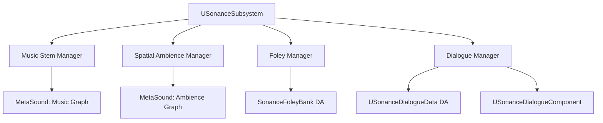

# Sonance — Overview

## Architecture

Sonance organizes all audio through four subsystems managed by a central `USonanceSubsystem`:

## Music Stems

Sonance's music system is stem-based. A `USonanceMusicTrack` Data Asset holds references to multiple MetaSound sources (stems), each with a role (Bass, Harmony, Melody, Percussion, SFX). The active set of stems plays simultaneously; individual stems can be faded in/out to match gameplay intensity without stopping the music.

## Spatial Ambience

Ambience layers are world-space audio zones. Each `USonanceAmbienceLayer` defines a set of MetaSound sources, a blend radius, and an intensity falloff curve. The Ambience Manager blends between layers as the listener moves through the world, with up to 8 active layers simultaneously.

## Foley Banks

`SonanceFoleyBank` Data Assets map surface types (Grass, Metal, Wood, Water, Gravel) to lists of `USoundBase` variations. The Foley Manager selects a random variation and adjusts pitch/volume based on movement speed and footstep force. Works with both Character movement and manual trigger events.

## Dialogue System

`USonanceDialogueComponent` manages dialogue playback for an actor. It consumes a `USonanceDialogueData` asset that holds a playlist of dialogue lines, each with localization tags, subtitle text, audio assets per locale, and priority. The system queues, interrupts, and resumes lines based on priority and game state.

### Localization Integration

Each dialogue line stores a map of `FName Locale → USoundBase*`. At runtime Sonance queries the current culture from `FInternationalization` and selects the appropriate audio asset automatically.

## Prioritization

All active sound requests carry a priority value. When the total number of active sounds approaches the hardware voice limit, Sonance culls the lowest-priority sounds gracefully — fade-out, not abrupt stop.
