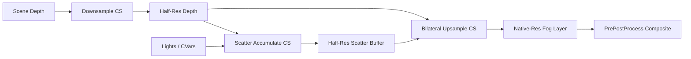

# Vapor — Overview

## Architecture

Vapor is structured around three C++ layers and a set of HLSL compute shaders.

```
UVaporSubsystem  (UEngineSubsystem)
    └── FVaporViewExtension  (FSceneViewExtensionBase)
            ├── PrePostProcessPass_RenderThread()
            │       ├── DownsampleDepth.usf      (CS, 8×8 groups)
            │       ├── ScatterAccumulate.usf     (CS, 8×8 groups)
            │       └── BilateralUpsample.usf     (CS, 8×8 groups)
            └── CVars  →  r.Vapor.*
```

`UVaporSubsystem` is created once per engine instance and owns the `FVaporViewExtension`. This keeps the view extension alive without relying on world lifetime, which avoids dangling-pointer crashes during PIE restarts.

## How It Works

### 1. Depth Downsample

The scene depth buffer is downsampled to half resolution. A min-depth tap selects the closest sample in each 2×2 neighbourhood to preserve thin geometry silhouettes at the upsample stage.

### 2. Scatter Accumulate

A ray-march loop steps through the frustum in world space. At each step the shader evaluates:

- **Rayleigh scattering** — wavelength-dependent sky contribution
- **Mie scattering** — directional light forward-scatter lobe (Henyey-Greenstein phase)
- **Beer–Lambert extinction** — exponential density falloff by height and radial distance
- **Point/spot light contribution** — shadow-map sampled attenuation for up to 8 additional lights

All parameters are read from a constant buffer populated from CVars each frame; no heap allocations occur on the render thread.

### 3. Bilateral Upsample

The half-resolution scatter buffer is upsampled to native resolution using a cross-bilateral filter guided by the full-resolution depth. Edge-aware weights prevent fog from bleeding across geometry boundaries.

## Key Concepts

| Concept | Detail |
|---------|--------|
| **CVar authority** | CVars are the single source of truth at render time. All other paths (Blueprint, PPV, detail panel) write to CVars. |
| **Permutation-based compilation** | Feature flags (sky glow, additional lights, fog volumes) are shader permutations, not runtime branches. |
| **PPV integration** | `AVaporPostProcessVolume` actor overrides CVars within its bounds, blending smoothly at the volume edge. |
| **Half-resolution pass** | The scatter accumulate pass runs at 50% resolution for performance. Quality can be raised via `r.Vapor.ResolutionScale`. |

## Diagram


