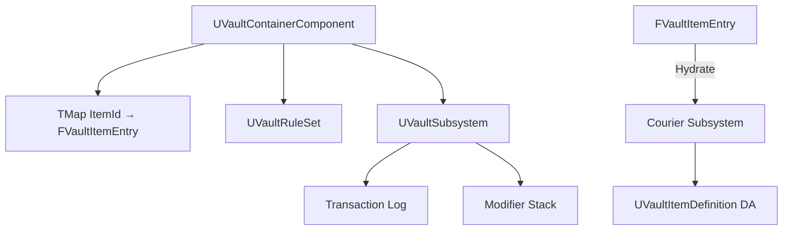

# Vault — Overview

## Design Philosophy

Traditional inventory systems store full `UObject` references per item, causing memory bloat when containers are large. Vault stores items as `FVaultItemEntry` — a minimal struct containing only a `FPrimaryAssetId`, a stack count, and a metadata map. Full `UVaultItemDefinition` objects are loaded via Courier only when needed (inspection, use, equip).

## Architecture

## Container Component

`UVaultContainerComponent` is the inventory. It attaches to any actor (player, chest, vendor). Multiple containers on one actor are supported (e.g., separate containers for weapons, armor, and consumables).

Key limits per container:
- **SlotCount** — maximum number of distinct item types.
- **MaxWeight** — total weight limit (each item definition specifies a weight).
- **StackLimit** — per-item-type stack limit (overridden per item definition if needed).

## Rule Sets

`UVaultRuleSet` is a Data Asset defining what items are permitted in a container and under what conditions. Rules run before add/remove operations and can veto them:

- `CanAdd(ItemId, Count)` — e.g., "only weapons allowed in this holster".
- `CanRemove(ItemId, Count)` — e.g., "quest items cannot be dropped".
- `CanTransfer(SourceContainer, DestContainer, ItemId)` — cross-container transfer validation.

## Modifier Stack

Item modifiers (enchantments, condition degradation, buffs) are stored as a `TArray<FVaultModifier>` per entry. Modifiers are resolved lazily when the item is hydrated or when stats are queried via `UVaultSubsystem::GetEffectiveStats`.

## Transaction Log

Every add, remove, and transfer is recorded as a `FVaultTransaction` in the subsystem's log. This enables undo, audit trails, and save-game serialization.

## Replication

`UVaultContainerComponent` uses a replicated `FFastArraySerializer` for the item entry map. Only changed entries are sent over the network — not the full inventory.
