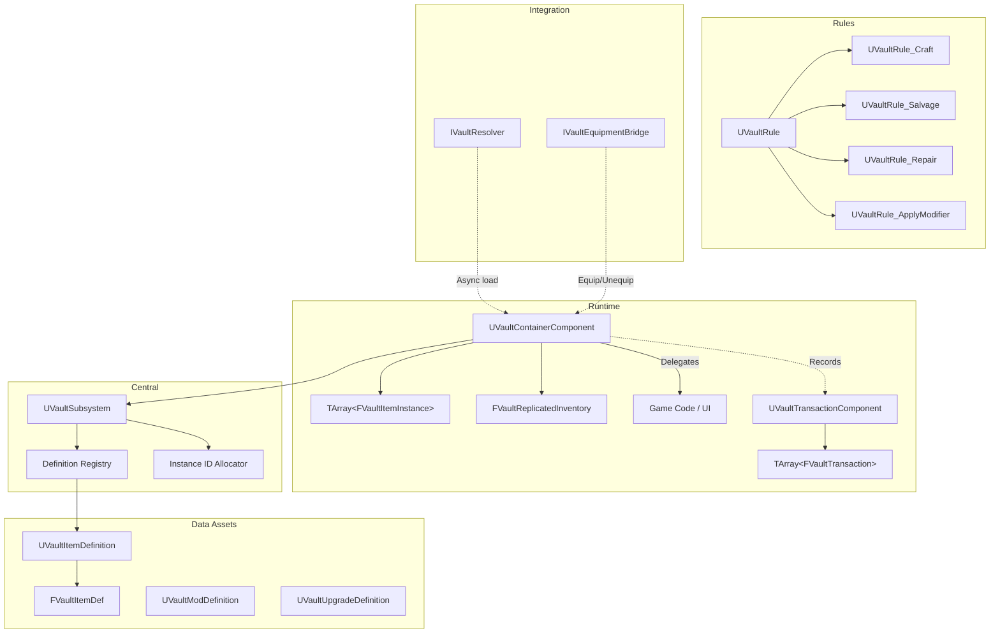
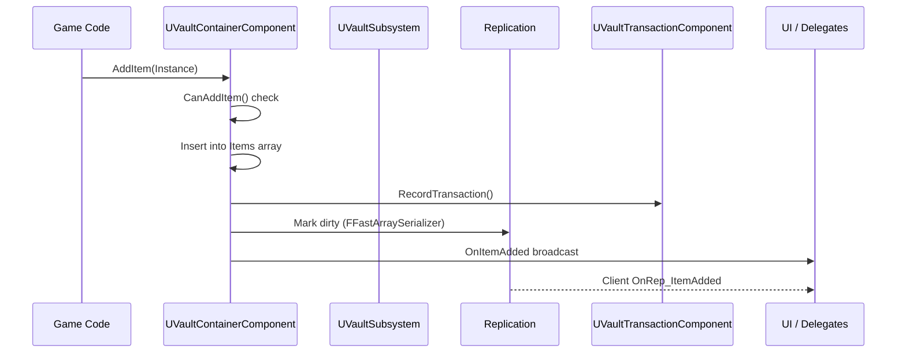

# Vault — Overview

## Design Philosophy

Traditional inventory systems store full `UObject` references per item, causing memory bloat when containers are large. Vault stores items as **`FVaultItemInstance`** — a lightweight struct containing only a `FPrimaryAssetId`, stack count, durability, runtime tags, and modifiers. Full visual/audio assets are loaded on demand through **tiered loading** — only loading what's needed for the current context (world pickup, UI thumbnail, first-person view, etc.).

## Architecture

## Core Systems

### [Container Component](api-reference.md#uvaultcontainercomponent)

`UVaultContainerComponent` is the inventory. It attaches to any actor — player, chest, vendor, loot drop. Multiple containers on one actor are supported (e.g., separate containers for weapons, armor, and consumables).

Four built-in constraint modes control capacity:

| Mode | Description |
|------|-------------|
| **Unlimited** | No constraints — infinite capacity |
| **SlotBased** | Limited by number of distinct item slots |
| **WeightBased** | Limited by total weight (each item defines its weight) |
| **SlotAndWeight** | Both slot and weight limits enforced |
| **Custom** | Override `CanAddItem` in Blueprint or C++ for any logic |

All operations (`AddItem`, `RemoveItem`, `TransferTo`, `EquipItem`, `UseItem`, etc.) return an **`FVaultTransactionResult`** with success/failure status, processed quantity, and failure reason.

### [Item Definitions](api-reference.md#uvaultitemdefinition)

`UVaultItemDefinition` is a `UPrimaryDataAsset` holding the immutable definition of an item type via **`FVaultItemDef`**. Each definition includes:

- **Identity** — `FVaultItemId` with `PrimaryAssetId`, category tag, and type tag
- **Display** — name and description text
- **Constraints** — weight, max stack size, max durability
- **Tags** — `FGameplayTagContainer` for filtering and rule matching
- **Fragments** — extensible `TMap<FGameplayTag, FInstancedStruct>` for game-specific data (stats, recipes, lore, etc.)
- **Modifier rules** — which modifier types are accepted and how many slots are available

### [Item Instances](api-reference.md#fvaultiteminstance)

`FVaultItemInstance` is the runtime representation of an item in a container. It stores only what changes at runtime:

- **InstanceId** — unique monotonic ID for tracking
- **DefPAID** — which definition this instance came from
- **Quantity** — current stack count
- **Durability** — current durability (-1 if not applicable)
- **RuntimeTags** — state tags like "Equipped", "Locked", "Cursed"
- **Modifiers** — applied `FVaultAppliedModifier` entries (enchantments, upgrades, cosmetics)
- **InstanceFragments** — per-instance extensible data

### [Modifier System](api-reference.md#uvaultmoddefinition)

Item modifiers represent enchantments, upgrades, cosmetics, or condition changes. Each modifier is defined by a `UVaultModDefinition` data asset and applied as an `FVaultAppliedModifier` on an item instance.

Key features:

- **Type-based filtering** — items declare which modifier types they accept via `AcceptedModifierTypes`
- **Slot limits** — `MaxModifierSlots` controls how many modifiers an item can hold (-1 for unlimited)
- **Per-instance data** — each applied modifier carries an `FInstancedStruct` for unique roll values, durability, colors, etc.
- **Type queries** — find modifiers by type, check for specific modifiers, bulk remove by type

### [Rules System](api-reference.md#uvaultrule)

`UVaultRule` is an abstract base class for inventory operations that go beyond simple add/remove. Rules validate prerequisites and execute multi-step operations. Four built-in rules ship with Vault:

| Rule | Purpose |
|------|---------|
| [**UVaultRule_Craft**](api-reference.md#uvaultrule_craft) | Consume input items, produce output items |
| [**UVaultRule_Salvage**](api-reference.md#uvaultrule_salvage) | Break down items into component materials |
| [**UVaultRule_Repair**](api-reference.md#uvaultrule_repair) | Restore item durability using materials |
| [**UVaultRule_ApplyModifier**](api-reference.md#uvaultrule_applymodifier) | Apply a modifier, consuming required materials |

Rules are **Blueprintable** — create custom rules by subclassing `UVaultRule` and overriding `CanApply` and `Apply`.

### [Transaction History](api-reference.md#uvaulttransactioncomponent)

`UVaultTransactionComponent` is an optional companion component that records every inventory operation as an `FVaultTransaction`. Each transaction captures:

- **Type** — Add, Remove, Equip, Unequip, Drop, Modify, Transfer, Use, RuleApply
- **Before/After** — item state snapshots
- **Timestamp** — game time when the operation occurred

Supports **rollback** (undo the last N operations), configurable history size, and server-authoritative rollback via RPC.

### [Tiered Asset Loading](api-reference.md#tiered-loading)

Vault uses a five-tier visual/audio loading system so you only load what's needed:

| Tier | Tag | When to Load |
|------|-----|-------------|
| **World** | `Vault.Visual.World` | Ground pickups, loot drops |
| **UI** | `Vault.Visual.UI` | Inventory icons, item cards |
| **FirstPerson** | `Vault.Visual.FP` | FP arms, weapon mesh, animations |
| **ThirdPerson** | `Vault.Visual.TP` | TP character mesh, animations |
| **Audio** | `Vault.Audio` | Pickup, equip, use, ambient sounds |

Each tier's data is stored as a **fragment** in the item definition. Convenience presets (`WorldOnly`, `PlayerPickup`, `PlayerEquipFP`, `NPCEquip`, etc.) make requesting the right tiers easy.

### [Replication](api-reference.md#replication)

`UVaultContainerComponent` uses `FFastArraySerializer`-based delta replication. Only changed entries are sent over the network — not the full inventory. Server RPCs handle authoritative operations:

- `ServerAddItem` / `ServerRemoveItem` — server-validated add/remove
- `ServerEquipItem` / `ServerUnequipItem` — server-validated equip state changes

Client callbacks (`OnRep_ItemAdded`, `OnRep_ItemRemoved`, `OnRep_ItemChanged`) fire delegates so UI stays in sync.

### [Integration Interfaces](api-reference.md#interfaces)

Vault integrates with external systems through two optional interfaces:

| Interface | Purpose |
|-----------|---------|
| [**IVaultResolver**](api-reference.md#ivaultresolver) | Async item resolution — load assets, create runtime objects (e.g., bridge to Manifest/Courier) |
| [**IVaultEquipmentBridge**](api-reference.md#ivaultequipmentbridge) | Equipment system integration — validate equip requests, sync stats (e.g., bridge to Arsenal) |
| [**IVaultContainerNotify**](api-reference.md#ivaultcontainernotify) | Notification interface for container owners — receive add/remove/full events without binding delegates |

### [Editor Tooling](api-reference.md#editor)

`UVaultEditorItemDefinition` provides a drag-and-drop authoring workflow with hard object references. The `UVaultItemConverter` utility converts editor assets to runtime `UVaultItemDefinition` data assets with soft references — keeping your cooked build lean.

## Data Flow

