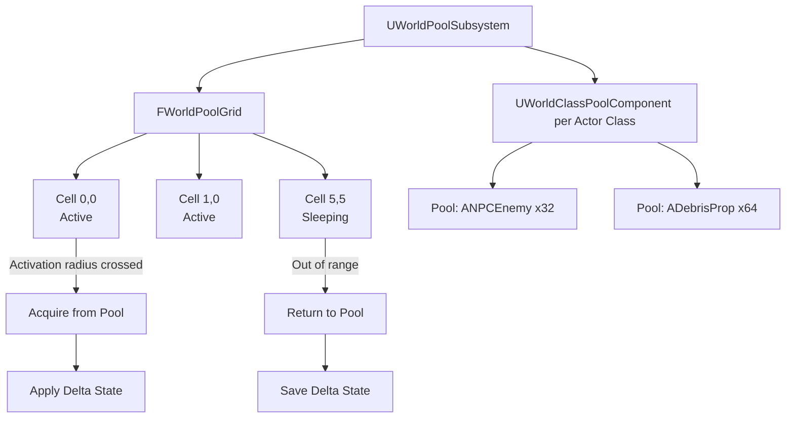

# WorldPool — Overview

## Problem Statement

Open-world games spawn thousands of actors (foliage creatures, ambient NPCs, debris, effects) but cannot keep all of them ticked and replicated simultaneously. WorldPool solves this by keeping a fixed-size pool of actor instances and spatially activating/deactivating them based on player proximity — similar to Unreal's World Partition but at the actor-instance level.

## Architecture



## Spatial Grid

`FWorldPoolGrid` divides the world into square cells of configurable size. Each cell tracks a list of logical "spawn requests" — not actual actors. When a cell enters the activation radius of any player, WorldPool acquires actors from the pool for each request and places them at the requested transforms. When a cell exits the radius, actors are returned to the pool.

## Delta Persistence

When an actor is returned to the pool its "delta state" (differences from the pristine definition) is serialized to a compact `FWorldPoolDeltaRecord`. Examples: an enemy that has lost 40% health, a crate that has been opened, a dynamic prop that was displaced by physics. On re-acquisition the delta is applied before the actor is visible to players.

## Pool Component

`UWorldClassPoolComponent` is a per-actor-class pool. It preallocates a configurable number of instances at startup and manages a free-list. Allocation and release are O(1).

```mermaid
graph LR
    FreeList[Free List\n[Actor3, Actor7, Actor12]] -->|Acquire| InUse[In Use\n[Actor1, Actor2, Actor4]]
    InUse -->|Release| FreeList
```

## Replication

WorldPool uses a spatial interest system. Dedicated servers activate all cells; clients receive actor relevance only within their subscription radius. Actors returned to the pool are marked irrelevant and removed from the replication graph — freeing bandwidth for active actors.
